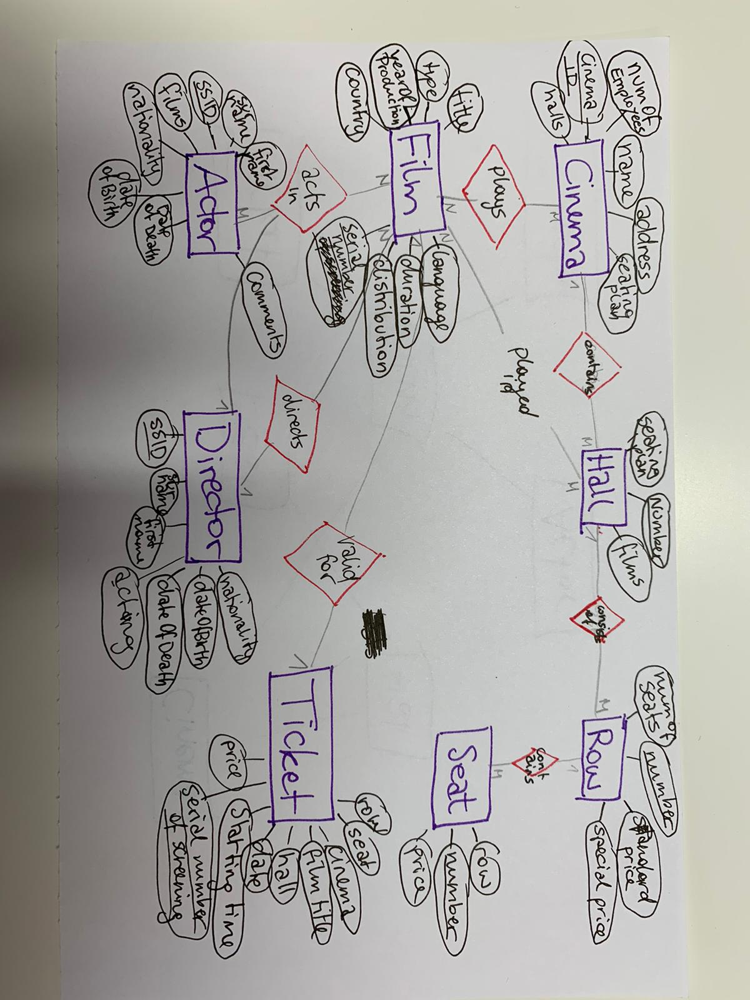

# Cinema
## Choose useful attributes and relations

The STAR-MOVIES company operates a cinema chain with several cinemas (Name,
Address... ). Each cinema can have several halls where the films are shown. The seating plan of each hall should be recorded; a row and a seat must be indicated for each seat. A box should be managed like a row.
It must be possible to create a seating plan. Of course, several films can be shown per room on one day. In order to be able to determine which seats are available for a performance, each ticket purchase must be noted. Each ticket should show: cinema, hall, film title, date, starting time, serial number within the screening, row, seat, price.
Provision must be made for pricing: Each row of a hall has a standard price, but for certain performances the row prices can be set individually. For information purposes, the actors should be recorded with their personal data (surname, first name, nationality, date of birth, date of death, comments, ... ) and it should be possible to tell which actors have acted in which films.
The analogous statements should also be possible for directors, whereby it can be assumed that there is only one director for a film. However, it is possible that the director also plays a part in a film.
The other data of a film include: Title, type (thriller, western, youth film, ... ), year of production, country, language, duration, distribution, etc.

Create a ERD and a Relation Model for this example

## ERM:

## textual presentation:

* Cinema (**cinema-ID:int**, name:varchar(32), address:varchar(32), numOFEmployees:int, numOfHalls:int)
* Hall (**number:int**, seatingPlan:image, films:varchar(32))
* Row (**number:int**, numberOfSeats:int, standardPrize:double, specialPrize:double)
* Seat (**number:int**, row:int, price:double)
* Ticket (**serialNumberOfScreening:int**, filmTitle:varchar(32), cinema:varchar(32), hall:int, date:date, startingTime:timestamp, price:double, row:int, seat:int)
* Film (**serialNumber:int**, title:varchar(32), type:varchar(32), yearOfPRoduction:int, country:varchar(32), language:varchar(20), duration:timestamp, distribution:varchar(32))
* Actor (**SSID:int**, surname:varchar(32), firstName:varchar(32), nationality:varchar(32), dateOfBirth:date, dateOfDeath:date, films:varchar(32), comments:varchar(32))
* Director (**SSID:int**, surname:varchar(32), firstName:varchar(32), nationality:varchar(32), dateOfBirth:date, dateOfDeath:date, films:varchar(32), comments:varchar(32), actingInFilm:boolean)

